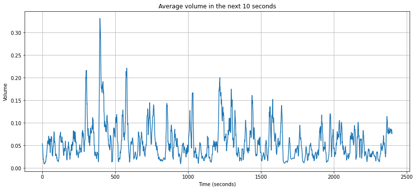

# Automatic Streaming Highlights

In a nutshell: Have you ever wanted to magically create a short video including all the highlights of your 7-hour Twitch video? Well, you have come to the right place. 

(Most of the information put here comes from my comments from the Jupyter Notebook)

This short repository (in development) contains a new feature for my **Automatic Gaming Sharing Tools** project (name can change during development). 

## FAQ

1. How does the algorithm work?

    The algorithm takes as input the whole video and it returns a short video that is basically each highlight found by the algorithm concatenated next to each other.

2. What does "highlight" means in this context?
    
    Similar to Zulko's implementation, a highlight for me in this case means **a very loud/noisy moment** during gameplay. As a brief example, usually when I play with my friends Halo Infinite, we tend to get very loud during certain matches or when we perform some objectives in the game. Another example would be a commented fighters videogame tournament where both commenters and players get very loud when a certain fantastic, wild moment occurs.

3. How many "highlights" or "loud moments" are taken into account? 

    This is an example from a graph created in a certain step by the algorithm using a 40min Fall Guys video:
    
    
    As we can see, there are some higher peaks through the whole video, by default, the algorithm takes into account the top 10% of the peaks and puts them in the highlights video. The selection of the peaks can be changed via the **peaks_times** variable found in the Jupyter Notebook.

4. Can I also automatically share this automatically created video? 

    This is currently a feature I'm working on. I plan to make possible the automatic upload to Youtube, Twitter and Instagram.

# Jupyter Notebook and Overview

The Notebook contains my experiments and my custom implementation using the code from Zulko's Automatic Soccer Highlights [1] in order to use it for my gaming streamings and my new project **Automatic Gaming Sharing Tools** which is a subtask of the **Automatic Video Uploader** project.

Similar to Zulko's implementation, I would like to make a video summary of a previously saved streaming video game, using the fact that myself and my friends (in the video that we recorded) usually scream, tend to be louder when something interesting happens. By this explained fact, in this project I select as a metric for my gaming highlights the **noisiness** of my clips in order for them to be put in the video. In other words, the loudest moments of the streaming will be the most considered to be put in the video summary, which is also the same metric that is used in the Zulko's algorithm.

At the moment, I'm also working on another metrics for **Automatic Gaming/Streaming Highlights** based on specific in-game sounds that specify a possible highlight as a multikill, objective complete in Halo Infinite using **speech recognition** and the text recognition of the same events such as reading **DOUBLE KILL, OBJECTIVE COMPLETE** directly from the video input using **text recognition**. The repo for that project can be found [here](https://github.com/spolo96/gaming-text-speech-recognition).

# References 

I infinitely would like to thank [Zulko](https://github.com/Zulko) for the **moviepy library** and this specific algorithm to perform the automatic streaming highlight. This library is what made possible my ideas and projects for **Automatic Video Uploader** and **Automatic Gaming Sharing Tools**. 

[[1] Automatic Soccer Highlights Compilations With Python](http://zulko.github.io/blog/2014/07/04/automatic-soccer-highlights-compilations-with-python/)